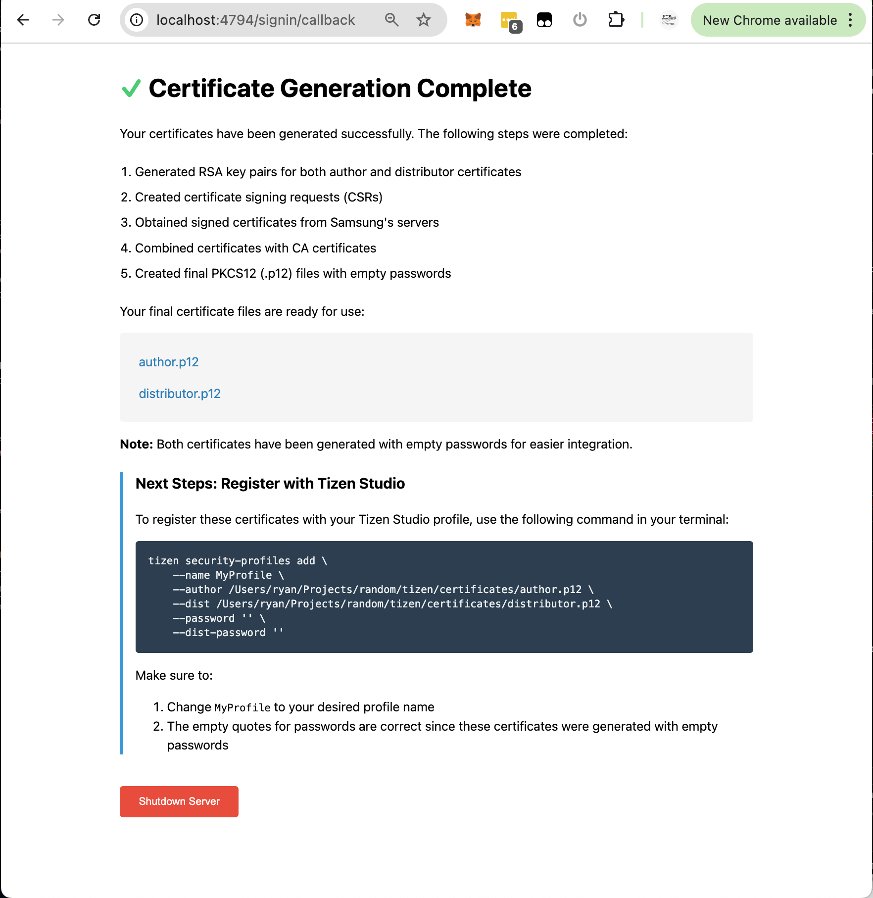

# Samsung Tizen Certificate Generator

A FastAPI web application that automates the process of generating Samsung Tizen developer certificates for both TV and other Tizen devices.

## Installation & Usage

```bash
# Install dependencies
pip install -r requirements.txt

# Run the server (for Tizen devices like watches)
python cert_server.py --device-id="<DEVICE_ID>" --email="you@example.com"

# Run the server (for TV devices)
python cert_server.py --tv --device-id="<DEVICE_ID>" --email="you@example.com"
```

Required parameters:

- `--device-id`: Your device's unique identifier
- `--email`: Your Samsung account email

Optional parameters:

- `--tv`: Generate certificates for TV devices (default is for other Tizen devices)

When you run the server, your browser will open to Samsung's login page. You'll need to sign in with your Samsung account to authorize the certificate generation. This provides the necessary OAuth access token for creating the certificates.

## Example Output



## How It Works

### Certificate Extension Discovery

The `certtool.py` module automates the process of obtaining Samsung's certificate generation parameters:

1. Downloads the latest extension_info.xml from Tizen Studio's repository
2. Locates the "Samsung Certificate Extension" package
3. Downloads and extracts the certificate extension ZIP
4. Traverses the nested ZIP files to find:
   - Required CA certificates
   - Java class files containing OAuth configuration

### Java Class Analysis

The tool performs basic Java class file parsing to extract constants from SigninDialog.class:

- Reads the constant pool section of the class file
- Extracts string constants containing:
  - SERVICE_ID for OAuth authentication
  - Login URL endpoints
  - Other required configuration values

This allows the tool to stay up-to-date with Samsung's latest certificate infrastructure without hardcoding values.

The application will:

1. Start a local web server
2. Open your browser to the Samsung authentication page
3. Handle the OAuth callback
4. Generate the certificates in the `certificates` directory

## Generated Files

The following files will be created in the `certificates` directory:

- `author.p12` - Author certificate in PKCS12 format
- `distributor.p12` - Distributor certificate in PKCS12 format
- Various intermediate files (.csr, .key.pem, etc.)

All certificates are generated with empty passwords for easier integration with development tools.

## Project Structure

- `cert_server.py` - Main FastAPI application and certificate generation logic
- `certtool.py` - Utility functions for Samsung certificate extension handling
- `requirements.txt` - Python package dependencies
- `ca/` - Directory containing CA certificates

## Credits

Special thanks to Andreas Mausch ([@andreas-mausch](https://github.com/andreas-mausch)) for the research and documentation of the Samsung certificate generation process. The certificate chain and generation process is based on his work in the [moonwatch project](https://gitlab.com/andreas-mausch/moonwatch/-/blob/master/certificates/CreateSamsungCertificate.md).

Additional thanks to [@bloodlee](https://github.com/bloodlee) for the [PyJavap project](https://github.com/bloodlee/PyJavap), which provided valuable insights into Java class file parsing without external dependencies. While PyJavap is more comprehensive, its approach to class file structure analysis helped inform the focused implementation used in this project.

## License

MIT License
